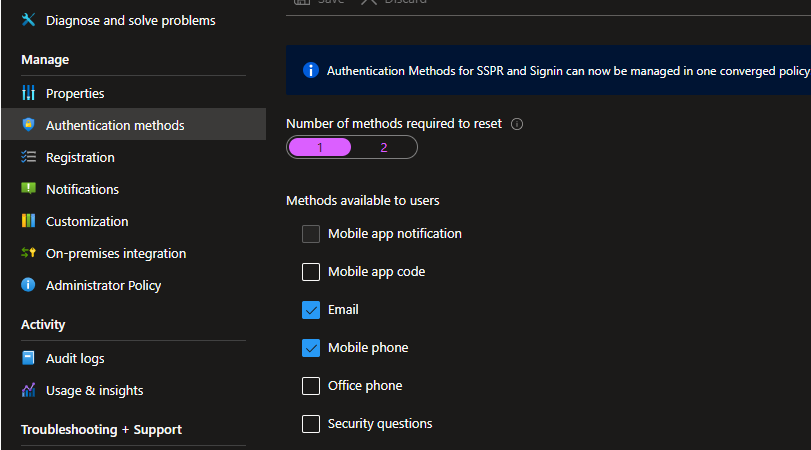
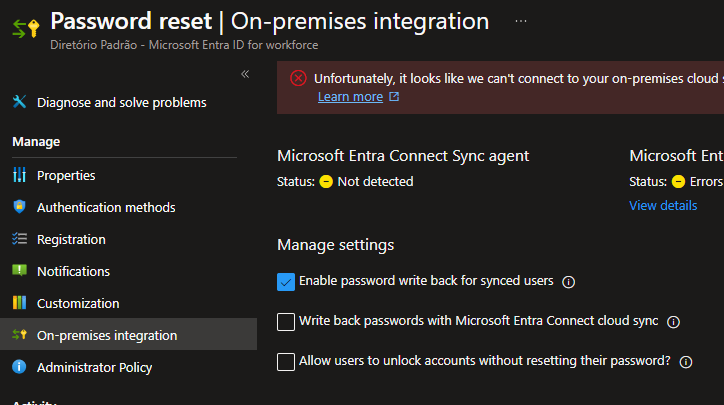
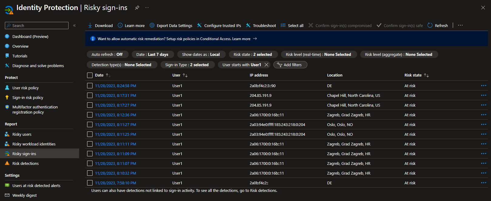
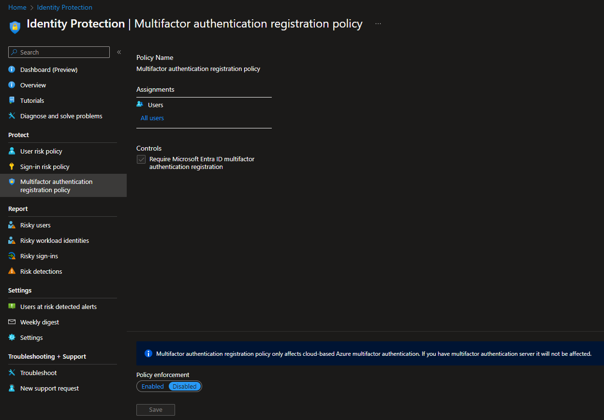
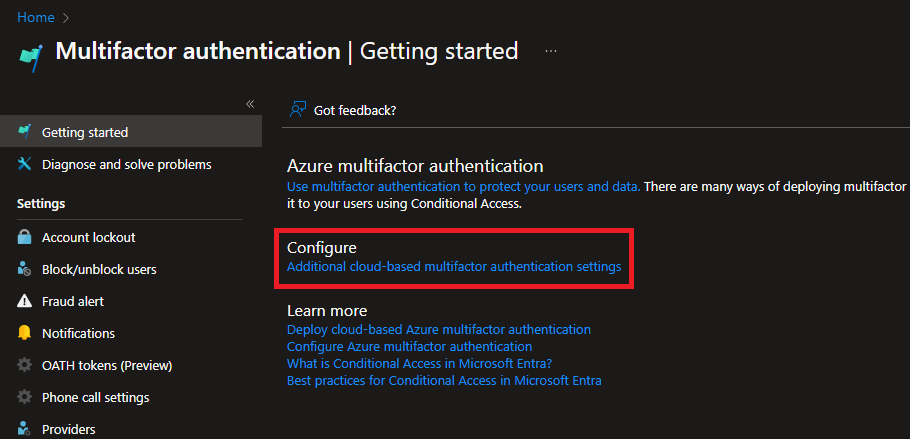
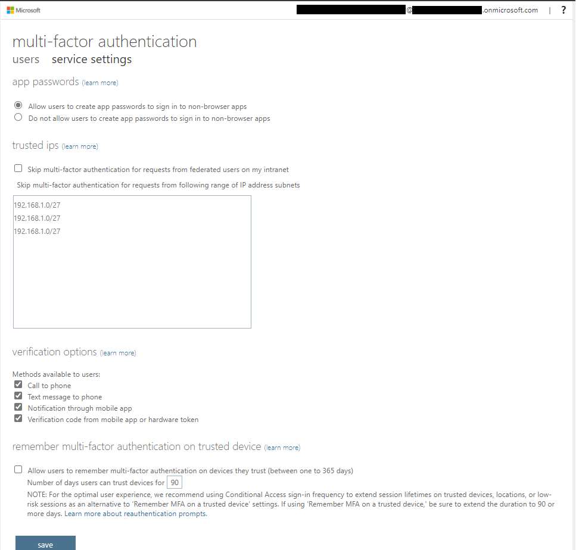
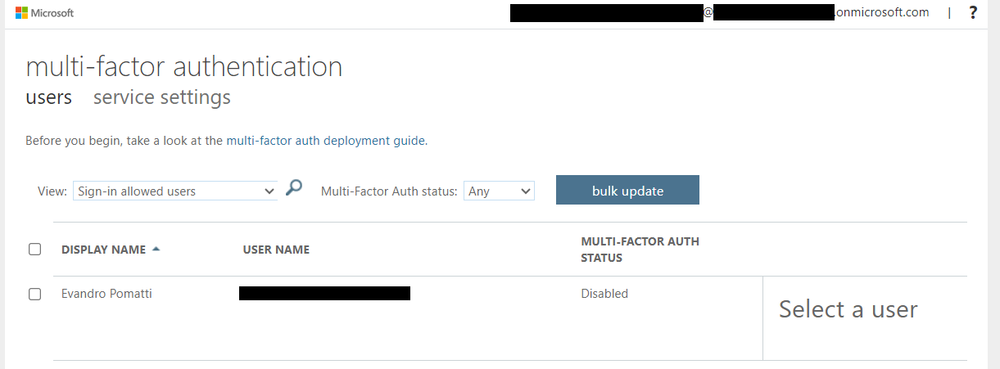
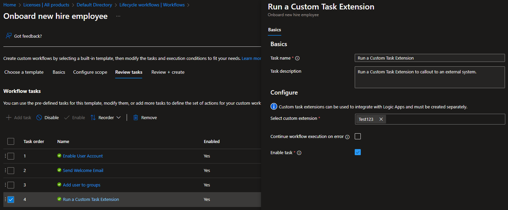
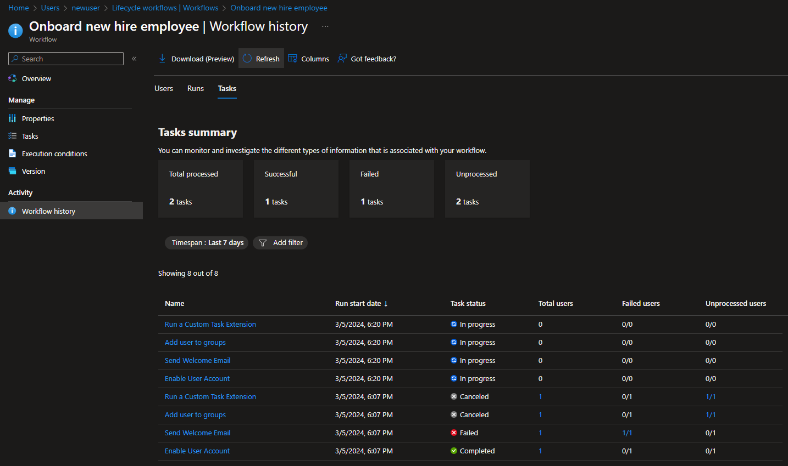

# Azure Identity security

Security implementation for various services from the Azure Identity domain.

> ⚠️ If you disable security defaults to test conditional access, don't forget to re-enable it

## Setup

Initiate the baseline resources:

> You must disable [security defaults][4] to use conditional access.

```sh
# Set up according to your Tenant
cp config/sample.tfvars .auto.tfvars

# Create the resources
terraform init
terraform apply -auto-approve
```

## Password rest

### Self-service password reset

You can configure this: `None`, `Selected`, `All`

### Authentication methods

Number of methods required to reset (1 or 2), and the methods available.



### Registration

Require users to register when signing in, number of days before users are asked to re-confirm their authentication information.

### On-premises integration



## Access Reviews

What to review:
- Teams + Groups
  - All Microsoft 365 groups with guest users
  - Select Teams + Groups 
- Applications

It is possible to create multi-stage.

Reviewers:

- Group owners(s)
- Selected user(s) or group(s)
- Users review their own access - if they can't, group owner reviews
- Managers of users ([synced attribute][10] from Active Directory)

Recurrence is set.

Settings are then configured such as:

- Apply or not the results to resource
- No response behavior
  - No change
  - Remove access
  - Approve access
  - Take recommendations
- Notifications
- Justifications
- etc.

Reviewers can access the access reviews on the [My Access][11] portal.

## Policy exclusions

It is important to remind that inclusions are overwritten by [exclusions][6]:

> When organizations both include and exclude a user or group, the user or group is excluded from the policy. The exclude action overrides the include action in policy. Exclusions are commonly used for emergency access or break-glass accounts.

## Identity Protection

Risk reports:

> Based of the portal, but also on the [documentation][1] and [blob][2]

- Risky users
- Risky workload identities
- Risky sign-ins
- Risk detections

You can enable User and Sign-in risk protection directly, or use Conditional Access (recommended).

Microsoft provides this [article][3] with tips for simulating risk events.

For example, simulating [anonymous IP address][5] using Tor browser to access https://myapps.microsoft.com/ (set the Risk level to `Low` in the dashboard).



## Conditional Access

A conditional access will be create with `Report-only` functionality. Change to `On` when ready.

This policy will require MFA when for risky logins.

### Cloud Apps

Cloud Apps such as Docusign and AWS.

### Sign-in frequency

Options such as periodic authentication (hours, days) or every time.

### Persistent Browser Session

> A persistent browser session allows users to remain signed in after closing and reopening their browser window.

Must have `All cloud apps` enabled.

### Continuous Access Evaluation (CAE)

> Continuous Access Evaluation (CAE) allows access tokens to be revoked based on critical events and policy evaluation in real time rather than relying on token expiration based on lifetime.

## MFA Policy

There is also a dedicated available MFA policy:



## MFA Additional Settings

To reach the MFA additional settings hot site:





## MFA Statues

Users can have the following [MFA statuses][7]:

- **Disabled (default)** - User not enrolled in per-user Microsoft Entra MFA. Does not affect Legacy, browser, or modern.
- **Enabled** - User is enrolled in per-user Microsoft Entra MFA, but can still use password for legacy authentication. Will be prompted to register for modern authentication when session or token expires.
- **Enforced** - User is enrolled per-user Microsoft Entra MFA and must sign-in with MFA.

Importantly:

> Don't enable or enforce per-user Microsoft Entra multifactor authentication if you use Conditional Access policies.

By accessing "All Users" > "Per-user MFA":



## MFA Licenses

Different methods are available to [license MFA][8] on Entra:

> Microsoft Entra multifactor authentication can be used, and licensed, in a few different ways depending on your organization's needs. All tenants are entitled to basic multifactor authentication features via Security Defaults. You may already be entitled to use advanced Microsoft Entra multifactor authentication depending on the Microsoft Entra ID, EMS, or Microsoft 365 license you currently have. For example, the first 50,000 monthly active users in Microsoft Entra External ID can use MFA and other Premium P1 or P2 features for free.

It is worth pointing out that on PIM, MFA enablement will override per-user settings.

## Custom Roles

Custom roles will be created.

**Entra ID** actions allow only for granted permissions.

**Azure RM** actions have the capability for `Action` (allow) and `Not Action` (deny).

Custom roles can also be shared across different subscriptions that trust the same Microsoft Entra tenant. For example, the assignable scope can ge set to a **Management Group**.

Current [limits][9] are **5,000** custom roles per tenant.

There are also relevant [prerequisites][12].

## Scenarios

The following additional scenarios are implemented in this project.

### Adding objects to a Security Group

It's possible to add the following objects to a Security Group:

- Users
- Security Groups
- Devices
- Enterprise Applications
- Managed Identities

You **cannot** add Application Registrations, they must be enterprise.

### Group nesting

For this scenario, the following groups are created:

| Name | Type | Assignable to Entra ID roles |
|----------|----------|----------|
| NestingGroup1 | Microsoft 365 group | Yes |
| NestingGroup2 | Security group      | No  |
| NestingGroup3 | Security group      | Yes |
| NestingGroup4 | Security group      | Yes |

In this scenario, this is currently prohibited:

1. Cannot nest Microsoft 365 into other groups.
2. Cannot nest groups into Entra ID assignable groups.

## Governance

To use all governance features, an additional **Microsoft Entra ID Governance** [license][13] is required. Most features are covered by Entrai ID Premium P2, but the most advanced require this license.

> As of the writing of this page

- Entitlement management advanced features
  - Verified ID
  - Custom extensions (Logic Apps)
  - Auto assignment
  - Directly assign any user
  - Guest conversion API
  - Sponsors policy
- Access reviews advanced features
  - PIM for Groups
  - Inactive Users reviews
  - Machine learning assisted access certifications and reviews
- Lifecycle Workflows (LCW)
- LCW + Custom extensions

### Lifecycle Workflows (LCW)

A security group called `LifecycleTestGroup` will be created, as well with a Logic App `logic-lifecycle-task` and a user `newuser`.

To use a Logic App with LCW, few [requirements must be met][14]. It might be easier to create a Logic App using the LCW console.

These resources can be used to create a lifecycle workflow:

1. Create (or use the existing) logic app as a custom extension for LCW
2. Create a new workflow from a template
3. Trigger the workflow (on-demand, or via schedule)

The user `department` will be `Marketing` for this exercise.

> The schedule time applies for the whole service, and the default settings is 3h (minimum 1h)

Here is an example with custom extension task:



Sample of final results after execution. Additional information is required for it work completely, such as the `manager` and `email` attribute.



---

### Clean-up

> ⚠️ If you disable security defaults to test conditional access, don't forget to re-enable it

```sh
terraform destroy -auto-approve
```

[1]: https://learn.microsoft.com/en-us/entra/id-protection/howto-identity-protection-investigate-risk
[2]: https://techcommunity.microsoft.com/t5/microsoft-entra-azure-ad-blog/combatting-risky-sign-ins-in-azure-active-directory/ba-p/3724786#:~:text=For%20each%20risky%20sign%20in,risk%2C%20risk%20history%20of%20users.
[3]: https://learn.microsoft.com/en-us/entra/id-protection/howto-identity-protection-simulate-risk
[4]: https://learn.microsoft.com/en-us/entra/fundamentals/security-defaults#protect-privileged-activities-like-access-to-the-azure-portal
[5]: https://learn.microsoft.com/en-us/entra/id-protection/howto-identity-protection-simulate-risk#anonymous-ip-address
[6]: https://learn.microsoft.com/en-us/entra/identity/conditional-access/concept-conditional-access-users-groups#exclude-users
[7]: https://learn.microsoft.com/en-us/entra/identity/authentication/howto-mfa-userstates#microsoft-entra-multifactor-authentication-user-states
[8]: https://learn.microsoft.com/en-us/entra/identity/authentication/concept-mfa-licensing#available-versions-of-microsoft-entra-multifactor-authentication
[9]: https://learn.microsoft.com/en-us/azure/role-based-access-control/custom-roles
[10]: https://learn.microsoft.com/en-us/entra/identity/hybrid/connect/reference-connect-sync-attributes-synchronized
[11]: https://myaccess.microsoft.com/
[12]: https://learn.microsoft.com/en-us/entra/identity/role-based-access-control/custom-create#prerequisites
[13]: https://learn.microsoft.com/en-us/entra/id-governance/licensing-fundamentals#features-by-license
[14]: https://learn.microsoft.com/en-us/entra/id-governance/configure-logic-app-lifecycle-workflows
